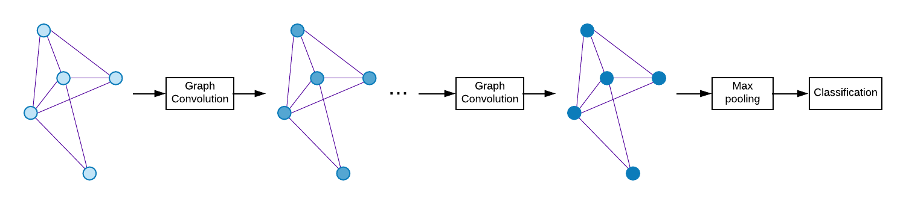
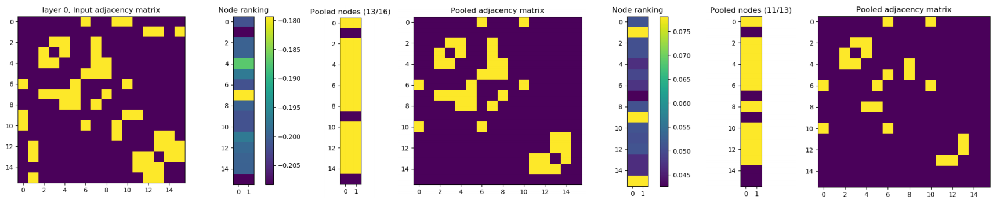

# Graph pooling based on Graph U-Net

## Overview


Results on one of the graph.



My attempt to reproduce graph classification results from recent papers [[1](https://openreview.net/forum?id=HJePRoAct7), [2](https://arxiv.org/abs/1811.01287)] using Graph U-Net. So far, my results using Graph U-Net are worse than the baseline (GCN).
I also compare to a recent work on Multigraph GCN (MGCN) [[4](https://arxiv.org/abs/1811.09595)].

This repository contains all necessary data for the PROTEINS dataset. It can be found [here](https://ls11-www.cs.tu-dortmund.de/staff/morris/graphkerneldatasets) along with similar datasets.

The baseline model is Graph Convolutional Network (GCN) [[3](https://arxiv.org/abs/1609.02907)].
The decoder part of Graph U-Net is not implemented yet in our code, i.e. the only difference with the baseline is using pooling based on dropping nodes between graph convolution layers.

Hyperparameters are taken from [[2](https://arxiv.org/abs/1811.01287)], but learning rate decay and dropout is also applied. The readout layer (last pooling layer over nodes) is also simplified to just `max` pooling over nodes.
All hyperparameters are the same for the baseline, Graph U-Net and Multigraph GCN (MGCN).

Implementation is very basic without much optimization, so that it is easier to debug and play around with the code.

```bash
python graph_unet.py --model gcn  # to run baseline GCN
python graph_unet.py --model unet  # to run Graph U-Net
python graph_unet.py --model mgcn  # to run Multigraph GCN
```

To use the [PyTorch Geometric](https://github.com/rusty1s/pytorch_geometric) data loader, add flag `--torch-geom`.

Repeating 10 times for different seeds:
```bash
for i in $(seq 1 10); do seed=$(( ( RANDOM % 10000 )  + 1 )); python graph_unet.py --model gcn --seed $seed | tee logs/gcn_proteins_"$i".log; done
```

Then reading log files can be done as following:
```python
results_dir = './logs'
acc = []
for f in os.listdir(results_dir):
    with open(pjoin(results_dir, f), 'r') as fp:
        s = fp.readlines()[-1]        
    pos1 = s.find(':')
    acc.append(float(s[pos1+1:s[pos1:].find('(') + pos1]))
print(len(acc), np.mean(acc), np.std(acc))
```

## Results

Average and std of accuracy for 10-fold cross-validation. We also repeat experiments 10 times (as shown above) for different random seeds and report average and std over those 10 times.

| Model                 | PROTEINS | PROTEINS (10 times)
| --------------------- |:-------------:|:-------------:|
| GCN [[3](https://arxiv.org/abs/1609.02907)]                                   | 74.71 ± 3.44* | 74.37 ± 0.31 |
| GCN [[3](https://arxiv.org/abs/1609.02907)] + *A<sup>2</sup>*                 | 74.36 ± 4.57 | 74.56 ± 0.26 |
| GCN [[3](https://arxiv.org/abs/1609.02907)] + *A<sup>2</sup>* + *2I*          | 74.45 ± 4.91 | 74.23 ± 0.37 |
| Graph U-Net [[1](https://openreview.net/forum?id=HJePRoAct7), [2](https://arxiv.org/abs/1811.01287)]                           | 72.39 ± 3.34 | 72.45 ± 0.88 |
| Graph U-Net [[1](https://openreview.net/forum?id=HJePRoAct7), [2](https://arxiv.org/abs/1811.01287)] + *A<sup>2</sup>*         | 72.90 ± 4.08 | 72.87 ± 0.52 |
| Graph U-Net [[1](https://openreview.net/forum?id=HJePRoAct7), [2](https://arxiv.org/abs/1811.01287)] + *A<sup>2</sup>* + *2I*  | 73.63 ± 4.67 | 73.18 ± 0.50 |
| Multigraph GCN (MGCN) [[4](https://arxiv.org/abs/1811.09595)]  | 74.62 ± 2.56 | 75.56 ± 0.27 |

*74.72 ± 2.90 with PyTorch 1.0.0.

Some datasets contain additional float-valued node attributes, which can improve graph classification a lot.
Note that some algorithms, including Weisfeiler-Lehman (WL) Graph Kernels, are not able to make use of these
additional attributes, so algorithms should be compared fairly.

| Model                 | ENZYMES | ENZYMES + continuous node attributes
| --------------------- |:-------------:|:-------------:|
| GCN [[3](https://arxiv.org/abs/1609.02907)] | 32.33 ± 5.07<sup>1</sup> | 51.17 ± 5.63<sup>2</sup> |
| Graph U-Net [[1](https://openreview.net/forum?id=HJePRoAct7), [2](https://arxiv.org/abs/1811.01287)] | 33.00 ± 4.88 | 48.33 ± 6.32 |
| Multigraph GCN (MGCN) [[4](https://arxiv.org/abs/1811.09595)] | 40.50 ± 5.58 | 59.83 ± 6.56 |


These results were obtained by running (similarly for Graph U-Net):

<sup>1</sup>
```python graph_unet.py -D ENZYMES -f 128,128,128 --n_hidden 256 -g --lr 0.0005 --epochs 100 --lr_decay_step 150```

<sup>2</sup>
```python graph_unet.py -D ENZYMES -f 128,128,128 --n_hidden 256 -gc --lr 0.0005 --epochs 100 --lr_decay_step 150```

Here, `lr_decay_step` can be any number larger than the number of epochs to avoid learning rate decay.


## Requirements

The code is tested on Ubuntu 16.04 with PyTorch 0.4.1/1.0.0 and Python 3.6.

The [jupyter notebook file](graph_unet.ipynb) is kept for debugging purposes.

**Optionally**:

<a href="https://github.com/rusty1s/pytorch_geometric">

</a>


## References

[1] [Anonymous, Graph U-Net, submitted to ICLR 2019](https://openreview.net/forum?id=HJePRoAct7)

[2] [Cătălina Cangea, Petar Veličković, Nikola Jovanović, Thomas Kipf, Pietro Liò, Towards Sparse Hierarchical Graph Classifiers, NIPS Workshop on Relational Representation Learning, 2018](https://arxiv.org/abs/1811.01287)

[3] [Thomas N. Kipf, Max Welling, Semi-Supervised Classification with Graph Convolutional Networks, ICLR 2017](https://arxiv.org/abs/1609.02907)

[4] [Boris Knyazev, Xiao Lin, Mohamed R. Amer, Graham W. Taylor, Spectral Multigraph Networks for Discovering and Fusing Relationships in Molecules, NIPS Workshop on Machine Learning for Molecules and Materials, 2018](https://arxiv.org/abs/1811.09595)
